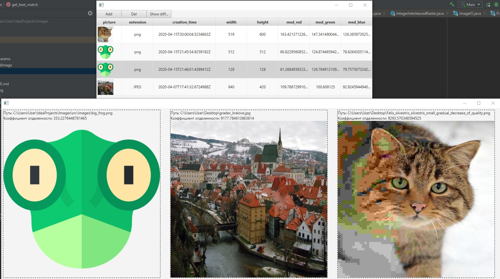

# project_images
Image descriptor and similar finder
Данная программа позволяет сортировать картинки по какому либо признаку, а также выводить рейтинг наиболее похожих для данной картинки на основании сравнения яркостей пикселей обеих картинок приведенныъ к фиксированному размеру

